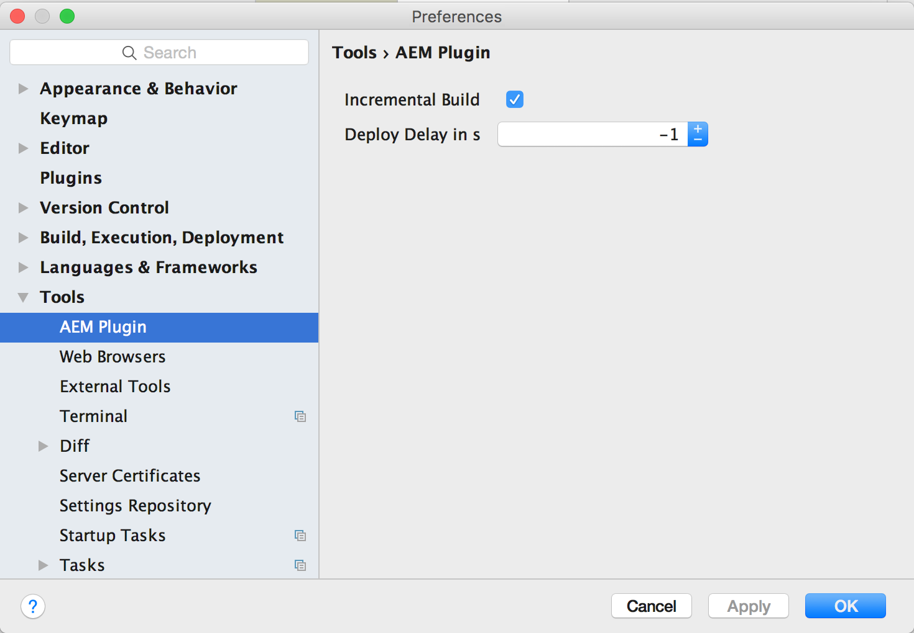
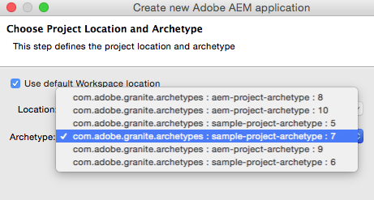
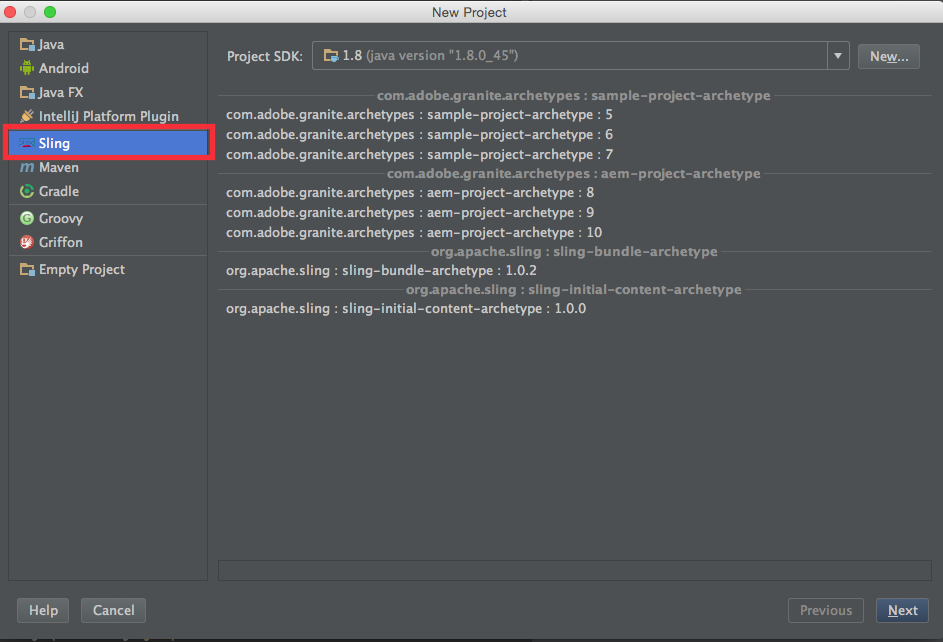
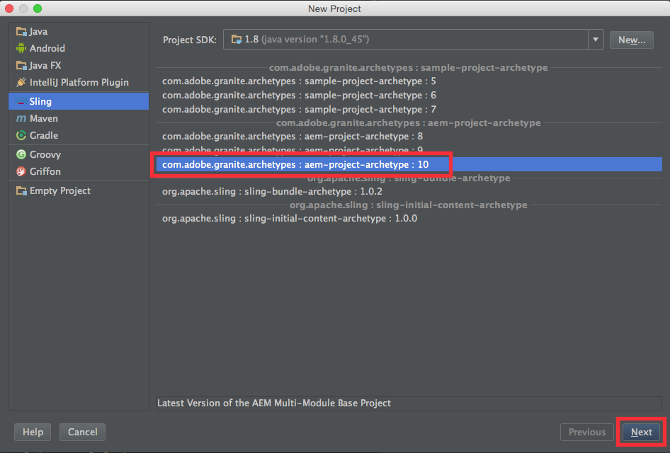
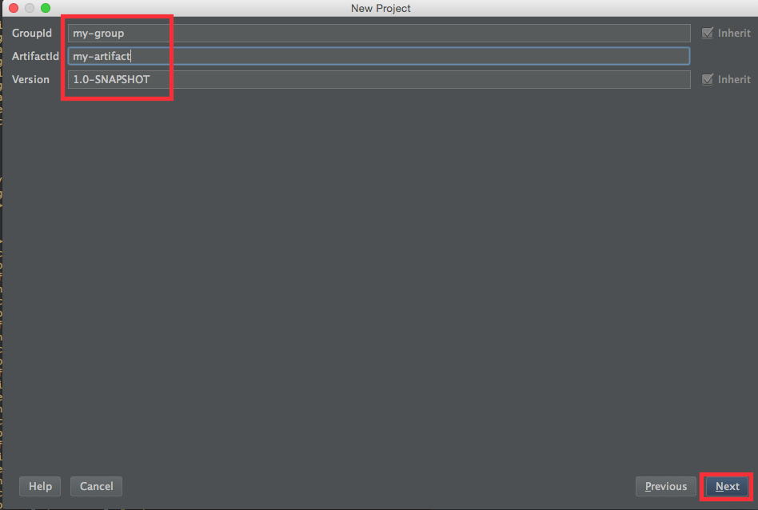
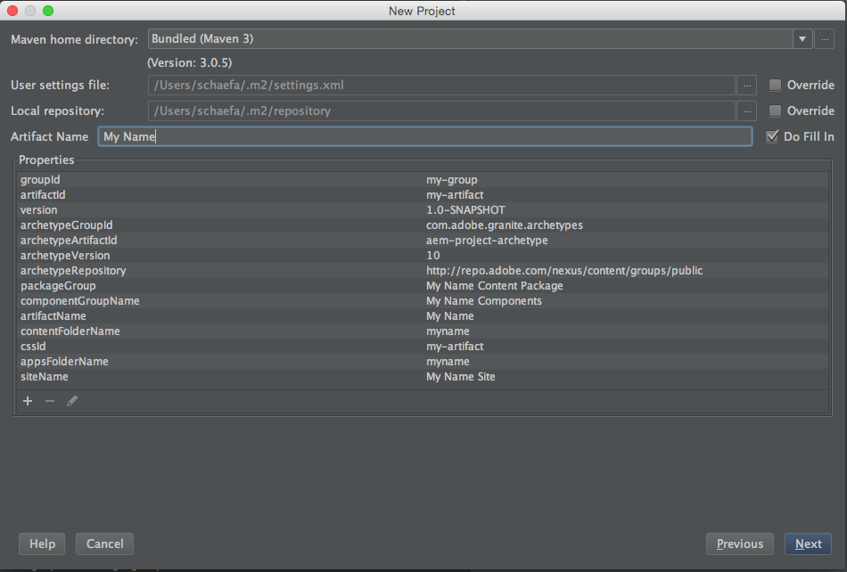
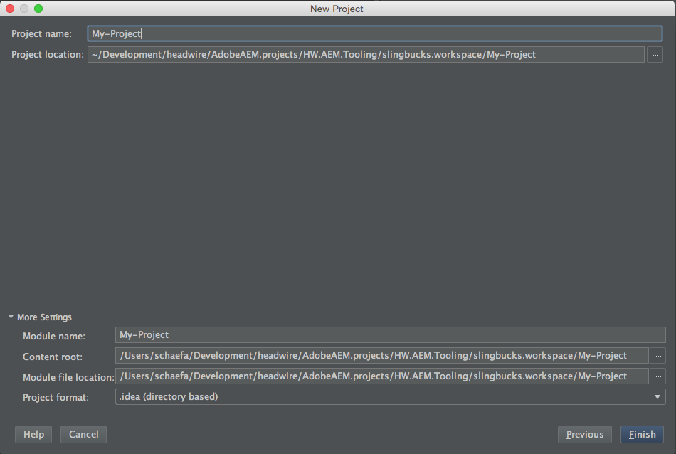
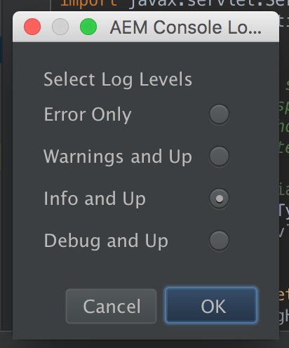
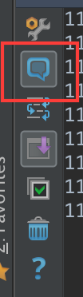
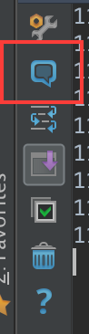

###AEM Tooling Plugin for IntelliJ IDEA

####1. Introduction

This is a plugin for IntelliJ IDEA version 14 and up that enables the user to develop, deploy and debug applications on a remote Sling or AEM Server. It is modeled after the Eclipse plugin but works slightly different due to the different philosophy behind IntelliJ IDEA.

#### 2. Prerequisites

This Plugin has a few requirements that must be met in order to work. Many of these requirements are coming from the Eclipse plugin and some are based on IntelliJ:

1. The Project must be based on **Maven** or use the **Osmorc** plugin to define the OSGi modules through OSGi Facets and Sling Content Facet to define Content and META-INFO folder 
2. Content Modules must be a **Content Package**
3. Java Modules must be a **OSGi Bundle**
4. Content Modules must provide a **Filter** (filter.xml) and a **jcr_root** folder
5. OSGi Bundles must be built with Maven (within or outside of the Plugin) before they can be deployed.
6. Parent Folders outside the filter.xml filters must either have a content configuration file (.content.xml) or must already exist on the server.

#### 3. Installation

The plugin is distributed as ZIP file and can be installed into IntelliJ quite easily. These are the steps to do so:

1) Start IntelliJ  
2) Open the Preferences  

3) Search for Plugins  
4) Click on **Install plugin from disk**  

5) Select ZIP file and click Ok  
6) Restart IntelliJ  
7) Go back to the Preferences, Plugins and make sure it is listed there  

This concludes the initial setup for any project that does **not** have any OSGi services with **annotations**.

#### 3.1. Maven OSGi Bundle Annotation Support

In order to support the OSGi Annotations this external plugin must be installed as well (the reason is that the
Maven OSGi Bundle plugin will create bind / unbind methods based on the annotations):

1) Open the IntelliJ Preferences again, go to Plugins 

2) Search for **Felix** and select the **Felix OSGi Annotation Processor Plugin**, then click on **Install Plugin**  

3) Accept the Download and Installation of the Plugin  

4) Accept the Restart of IntelliJ to activate the Plugin  

The **Felix OSGi Annotation Processor** is hooking into the compilation process and at the end of it it will handle the
**Annotation**similar to what the Maven OSGi Bundle plugin does. So when the compilation concludes the created class has
the additional methods defined like **bind...()** and **unbind...()**. This is especially important to support the
**Hot Swap** feature (runtime updated of Java code during debugging).

#### 4. Project Setup

This plugin works both with **Maven** or with a plain IntelliJ project as long as OSGi Modules **Jar** files are created correctly. **Maven** for sure it the easiest way to handle a Sling / AEM project but that is not required anymore.

**Attention**: IntelliJ has no way to generate a ZIP file based on resources so to create an Sling Package. It will deploy the content but **not create** a package. 

**Note**: there is a checkbox called **Load By Default** below the Connection name and description. If one is selected then the plugin will do the **Connect in Run or Debug Mode** right when IntelliJ is started to that user can start working on that project right away. Keep in mind that the **Sling or AEM Server** must be started at that time otherwise the connection will fail and must be executed manually later. 

To deploy and debug the remote AEM server the plugin needs to know which sever to connect to, user and password etc. For that the user needs to create at least one **Server Configuration**. It is possible to have multiple server configurations and to deploy to each of them separately even though only one at a given time.

**Note**: keep in mind that Server Configurations are **per Project** and Server Configurations must be created for new Projects. 

A Server Configuration is created by clicking on the plus (+) icon. After the creation the Server Configuration can be edited by the edit icon (3rd from the left). Configuration are only created / stored when the configuration is valid and finished by clicking on the **Ok** button. Otherwise the changes are discarded. So here we go:

1) Open the Plugin by clicking on its Icon (if not already opened)  

2a) To Create: Click on the plus (+) icon  

 
 
2b) To Edit: Select a Configuration and click on the edit icon  

3) Enter the necessary info for the host  

**Note**: Default means that if the plugin is opened this server configuration will be automatically connected in run mode. There is only one server configuration allowed to be default.  
**Note**: Build with Maven is a flag that enables (default) or disabled the automatic Maven Build when an OSGi Bundle is deployed. This feature is making sure that the latest changes are deployed rather than the last, external built archive.
**Attention**: For unknown reasons the first Maven Build is failing as it cannot find its **Run** message window. Any subsequent build seems to work just fine and so the plugin will display an alert asking the user to redo a deployment.  

4) Edit the timeouts (not supported yet)  

**Attention**: as of now the OSGi Client does not support configurable timeouts and the Debug Connection does not need one.

5) Edit the Publishing

**Attention**: the automatic deployment of changed resources can be disabled but for now the automatic deployment on Maven build is not supported.  

6) Edit the Installation

**Attention**: because IntelliJ IDEA does not support incremental build in a Maven project the installation directly from the File System is disabled.

#### Maintenance Services

##### Server Configuration Verification

In order to prevent issues the Plugin has a Verification action that can be used to make sure the Project is compatible with the Plugin prerequisites. Press the Verification Icon and the system will go through the modules and check if they pass the requirements. If there is an issue an alert will be shown indicating the problem and the module in question is marked as **failed**.

##### Purge Local Plugin Data Cache

In order to speed up deployment the plugin keeps the last modification timestamp stored locally both in memory as well as on the file system. With that any file that has **not changed** since the last deployment is not deploy again. 

**Attention**: the plugin data cache is **per project and server**. So if a server connection changes or server changes it is necessary to purge the cache to update the server correctly.

With the **Purge Local Plugin Data Cache** the user can wipe these cached modification timestamps and make sure the project is deployed from scratch. This is especially important if the project is deployed onto multiple servers.  
Another way to accomplish a full deployment without dropping the cached modification timestamps is to use **force deploy**. Keep in mind though that the **Purge** is clearing of all cached timestamps whereas the **Forced Deploy** is only temporary ignoring them.

##### Global Plugin Configuration

The AEM Plugin has a single property that can be configured. Opening the IntelliJ Preferences and go to the **Other Settings** and you can enable / disable the **incremental builds**. This setting will enable or disable the automatic compilation while saving a Java class file similar to Eclipse.  

The **Deploy Delay** is a property that if set to a positive number will delay automatic deployments and queue them up. So if you change a file and have a Delay of 30 seconds then any other changed files will queue up until the 30s are over. Keep in mind that the system will queue up changes if the deployment takes some time as it is executed in the background.

#### Run against AEM / Sling Server

**Attention**: in order to work on a Server Configuration you need to have one selected and this one is then use to connect to. Beside the Debug Connection which is established a physical socket connection all actions are executed against the current selected configuration aka server on a temporary connection. That said in order to prevent accidental deployment to different servers if there is a connection to a  server then you can only work against this server. You have to **stop that connection** in order to work with another server. Starting the connection is Run Mode is just making sure that for the time the Run Mode is established any work will be done against that and only that server.

**Note**: Selecting the Server Configuration or the Module is the same in this context. 

Running against the currently selected AEM Server is creating or updating the project module in the server configuration, checking if the Support Bundle is installed and see if the current resources are update to date or out of date.
If a Server Connection is marked as **default** then this will be happening automatically when the plugin is opened for the first time.

In order to run you need to click on the **play** icon:

Then you will see the Configuration and its Modules together with their states:

#### Deploy the Modules

**Attention**: OSGi Modules are deployed as a JAR file and so the Maven module has to be built beforehand. Afterwards the JAR file can be deployed as OSGi Module to the AEM OSGi container.  
**Attention**: if the **Build with Maven** flag is disabled the plugin will deploy the last built archive which might not contain the latest changes.  

There are three ways to deploy the modules:  
1) Deploy the OSGi Module (will always deploy all files)
2) Deploy any **any changed** content files  
3) Force Deploy **all changed** content files

The deployment of the resource files can take some time depending on the number of changed files. After an initial deployment the deployment should be much quicker as only the changed resources are deployed which normally only happen when files are changed outside of IntelliJ IDEA.

The **forced** deployment will take its time as all resource files are deployed. This option should only be used when the project is out of sync with the server but it's execution can be limited to a selected module.

This are the icon to deploy the modules:

**Attention**: the **Forced Deployment** is temporary ignoring the cached timestamps. If this deployment fails all caches are still in effect.

#### Deploy of Selected Module

If a Module is selected inside the Server Configuration Tree then only **this** module is deployed. The same thing applies to the Context Menu (see below).

#### Manage Modules

Modules can be **excluded** from the **Deployment** so that the content files or OSGi packages are not synced with / deployed on the server. Any excluded files can be included again.

To bring up the build click on the **Manage Build Configuration** icon:

This will bring up a Dialog where the Modules are listed. The left side are the excluded and the right side are the included modules. In order to exclude or include a module select the module and click the appropriate button to move it to the other side:

#### Context Menu Options

All of the Toolbar Actions can be executed from the Context Menu inside the plugin window. The selection depends on the current selection and its current state. The root entry (Server Configurations) will only provide **Add New Configuration** but all others will provide all the actions which some might be enabled or disabled.

This is the Root Entry Context Menu:

This is a Server Configuration Context Menu:

Finally this is a Module Context Menu:

#### Debugging the Code on AEM Server

In order to debug code on the AEM Server the AEM server must be started in debug mode which requires these properties to be added to the startup:

	-agentlib:jdwp=transport=dt_socket,server=y,suspend=n,address=30303

In this example 30303 is the **Debug Port** and can be adjusted to your needs as long as it does not conflict with any other TCP/IP ports used especially the AEM Server HTTP port (normally 4052).

Keep in mind that **server=y** means the AEM Server is the target of the debug connection and must not be changed.

After the AEM Server is up and running (it is probably best to wait until the login page shows up) and then you can connect from the plugin.

#### Setting up a New Maven Project Manually

**Note**: the plugin now supports the creation of a project using the Sling / AEM Archetypes from inside IntelliJ IDEA. Have a look at the **next** section.

In order to have a good starting point it is best to create a new Maven based on the **Adobe Maven Archetypes** which will generate a base project. That project can then be easily imported into IntelliJ IDEA by **Open** just that the root **pom.xml** file.

For more information about the Archetypes head over to its [GitHub Project Page](https://github.com/Adobe-Marketing-Cloud/aem-project-archetype) and checkout their description.

**Attention**: what the description forgets to mention is that if you don't have the Adobe repo in your Maven **settings.xml** then it will fail. If you have many projects then you might want to use a project specific settings file which would look like this:

	<?xml version="1.0" encoding="UTF-8"?>
	<settings xmlns="http://maven.apache.org/SETTINGS/1.0.0" 
	          xmlns:xsi="http://www.w3.org/2001/XMLSchema-instance" 
	          xsi:schemaLocation="http://maven.apache.org/SETTINGS/1.0.0 http://maven.apache.org/xsd/settings-1.0.0.xsd">
  
	<!-- This will not work with anyone that works outside of the Xilinx Network
	    <mirrors>
	        <mirror>
	             <id>nexus</id>
	            <name>Xilinx Nexus Server</name>
	            <url>http://wem-tools:8081/nexus/content/groups/public/</url>
	            <mirrorOf>external:*</mirrorOf>
	        </mirror>
	    </mirrors>
	-->
	    <profiles>
	      <profile>
			<id>cq</id>
			<activation>
				<activeByDefault>true</activeByDefault>
			</activation>
			<repositories>
				<repository>
					<id>adobe</id>
					<name>Adobe Repository</name>
					<url>http://repo.adobe.com/nexus/content/groups/public/</url>
					<releases>
						<enabled>true</enabled>
					</releases>
					<snapshots>
						<enabled>false</enabled>
					</snapshots>
				</repository>
			</repositories>
			<pluginRepositories>
				<pluginRepository>
					<id>adobe-plugins</id>
					<name>Adobe Plugin Repository</name>
					<url>http://repo.adobe.com/nexus/content/groups/public/</url>
					<releases>
						<enabled>true</enabled>
					</releases>
					<snapshots>
						<enabled>false</enabled>
					</snapshots>
				</pluginRepository>
			</pluginRepositories>
		</profile>
	  </profiles>
	</settings>

Then you just add
	-s ./settings.xml
to your Maven command line and you will be able to generate your project.

An example for the generation of a project would be like this:

	mvn archetype:generate \
	-DarchetypeGroupId=com.adobe.granite.archetypes \
	-DarchetypeArtifactId=aem-project-archetype \
	-DarchetypeVersion=10 \
	-DgroupId=com.test.sample \
	-DartifactId=sample-aem-project \
	-Dversion=1.0.0-SNAPSHOT \
	-Dpackage=com.test.sample \
	-DappsFolderName=aemsampleapps \
	-DartifactName='Sample AEM Project' \
	-DcomponentGroupName=aemsample \
	-DcontentFolderName=aemsamplecontent \
	-DcssId=asp \
	-DpackageGroup=aemsamplecontent \
	-DsiteName='AEM Project Sample' \
	-s ./settings.xml

The first three options are setting up the Maven project. The **package** is the Java package of your Java source code (OSGi Services, tests etc). The **appsFolder** is the name of the folder underneath **/apps** in the JCR tree. The **artifactName** is the description of the Maven project. **componentGroupName** is the name of the Group that the Components are placed in inside the Components Dialog. The **contentFolderName** is the name of the folder your content will be placed under the **/content** folder. The **packageGroup** is the group name of the apps / content package.

You can omit all properties that do not start with **archetype** and it will ask you with a prompt.

Here is a list of all supported archetypes:

#### Setting up a New Maven Project in the Plugin

In the 0.6-BETA-1 the creation of a Sling / AEM project is integrated into the plugin. It is as simple as selecting the desired archetype, adding some properties and the project is created and added as a new IntelliJ IDEA project. It works similar to the creation of a generic Maven Archetype project but it is specific to the Sling / AEM Archetypes adding support to the required properties of the AEM Archetypes.

In order to create a new project these are the steps to be done:

1) Select Menu -> File -> New -> Project or Menu -> File -> New Project

2) Select the **Sling** Group on the left and then select the appropriate archetype on the right

3) Enter the Maven Project Properties

4) Enter the Archetype Properties

**Attention**: The Artifact Name on the top is the same as the property with the same name below. It is used to fill in rest of the properties so that all required properties are fill when this field is entered. In order to prevent that you can uncheck the **Do Fill In** checkbox on the side.
After you entered the artifact name you can still go to any property and change it's value but as long as **Do Fill In** is checked any changes to the Artifact Name text field will reset any changes.
**Attention**: even though the Artifact Name is the same as the **artifactName** property below the plugin will take the value of the property in the list below. The **Artifact Name** field is only there for **convenience**.

5) Add the Project Settings and Finish it

#### Importing Content from AEM Server

Much of the Content cannot be created manually without having an existing structure to copy from but even then it is not quite easy to get it right. For that a page, page component etc should be created on the server and then imported from that server into our local IntelliJ project. Here is how to do it:  

**Attention**: it is advisable to update your project with your Version Control System and deploy any changes to the server to avoid out of sync issues before making any changes to the server. In addition changes from the imported should be placed into the VCS fairly quickly to avoid problems for other developers.

1) **Right-click** on the node to which the content is imported. Keep in mind that content is imported from the corresponding node in the JCR tree.
2) Go to the **AEM** entry in the context menu and there select **Import from**.
3) Let the import run through

Now verify the import and add the changes to your Version Control System (VCS).

#### AEM Console

The plugin features its own notification console which will only show notifications from the plugin. It is more or less a copy of the Event Log that comes standard with IntelliJ. There is one
key difference and that is the configuration of it. Instead of the selection what component it logs it provides a list of log levels. The AEM Console can show errors, warnings, info and debug levels
which include all the previous levels.

**Note**: By default IntelliJ will show balloons for the messages which can be overwhelming if the log level is info or debug. In case you want to switch off the balloon messages then make sure that the
          background of the ballon is not highlighted.

###### AEM Console Balloon Message On:

###### AEM Console Balloon Message Off:

#### Troubleshooting

##### Installation

If the installation or startup of the plugin fails please have a look at the idea.log and report any errors / exceptions. The plugin is designed for IntelliJ **14 and up** and your milage may wary with older versions.

##### Configuration

If you can connect to your AEM Server through a web browser you should be able to connect to it through the plugin. That said for the the Debug Connection the port must be opened for you in order to debug. It is also preferable to keep the server for development close to reduce the lag and latency.
If the Debug Connection is failing for unknown reasons then a TCP Proxy can be used to watch the conversation between the IDEA and AEM. A good tool for that is [The Grinder](http://grinder.sourceforge.net/g3/tcpproxy.html) which can be installed quickly and reports any traffic between IDEA and AEM. In order to make it work you need to set the outgoing connection port of the debug port of the AEM server and the incoming connection port to the port configured in the plugin and they must be different. Then you can connect to the AEM Server through the proxy and you might be able to see why the connection fails.

###### Password

The password in the Server Configuration is left empty and will only show dots for input when a new password is entered. A empty field indicates that the password hasn't changed and **does not** have to be reentered.

##### Connection

If the Server is connected to in run mode (to see if the modules / resources are up to date) the physical connection will close. That said in order to prevent accidental switches between servers the connection must be stopped even if the connection is not used anymore. After the connection is stopped the user can check, connect or deploy to another server by starting this connection in **run mode**.

##### Deployment

The plugin will not check OSGi dependencies and successful activation of modules. OSGi can deploy a module successfully but fail to activate or even to enable a component. 

It is **recommended** to make a full deployment of the project at the beginning of major changes including pulling changes from GIT to ensure that everything is properly deployed. Afterwards Resources, OSGi Modules and classes can be deployed incrementally.

For the Content there is a problem where the Jackrabbit client code cannot handle parent folders of filtered files which are outside the filter and do not contain a content configuration file (.content.xml) or do not exist on the server. For example the filter has an entry **/apps/test/components** and there is a parent folder called **/apps/test** and it neither contains a .content.xml file nor does it exist on the server.  

There are two ways to fix them. Either create a .content.xml file or deploy the content outside of the plugin first to the server manually so that the folder already exists when the content is deployed.

Keep in mind that the Plugin keeps a local cache of the last deployed time of Content files and afterwards will only deploy them when a change to the file were made. So if there were any changes made to the project that are not reflected in a changed last modification timestamp of a file then it is advisable to either **Reset the Configuration** or do a **Forced Deployment**. Both are doing more or less the same but a reset it permanently reseting the cache whereas the Force Deployment is (temporary) ignoring it. The forced deployment can be limited to a module and in does not change the cached timestamps.

###### Fixing Deployment Issues

These are steps to troubleshoot deployments:

1. Verify the Project
2. Fetch any changes from VCS
3. Purge Plugin Cache Data and Deploy or Force Deploy
4. Build and Deploy the Project either manually or via Maven (with Profiles) outside the Plugin

###### Hot Swap

When the plugin is connected in **Debug Mode** to the remote AEM Server a class can be hot swapped if there were only changes made to **method bodies**. Hot Swap will fail if there are any changes made to the class (adding methods, adding members, changing method signatures etc). If the incremental build is enabled the HotSwapping is done whenever a Java file is saved.

Because the Hot Swap is done automatically class changes will cause an error during development if there the Connection is started in Debug Mode. Therefore regular development should be done with the Debug Connection stopped.

**Attention**: HotSwap will replace class code **in memory only** meaning that a restart of the AEM Server will wipe any changes. It is necessary to deploy OSGi modules as soon as possible to avoid erratic behavior.
