###AEM Tooling Plugin for IntelliJ IDEA

####1. Introduction

This is a plugin for IntelliJ IDEA (version 14 and up) that enables the user to develop, deploy and debug applications on a remote Sling or AEM Server. It is modeled after the Adobe AEM Eclipse plugin but works slightly differently due to the different philosophy behind IntelliJ IDEA.

#### 2. Prerequisites

This Plugin has a few requirements that must be met in order to work. Many of these requirements come from the Eclipse plugin and some are based on IntelliJ:

1. The Project must be based on **Maven** or use the **Osmorc** plugin to define the OSGi modules through OSGi Facets and Sling Content Facet to define Content and META-INFO folder 
2. Content Modules must be a **Content Package**
3. Java Modules must be a **OSGi Bundle**
4. Content Modules must provide a **Filter** (filter.xml) and a **jcr_root** folder
5. OSGi Bundles must be built with Maven (within or outside of the Plugin) before they can be deployed.
6. Parent Folders outside the filter.xml filters must either have a content configuration file (.content.xml) or must already exist on the server.

#### 3. Installation

The plugin is distributed as ZIP file and can be installed into IntelliJ quite easily. These are the steps to do so:

1) Download the latest plugin release zip file from the [project wiki](https://github.com/headwirecom/aem-ide-tooling-4-intellij/wiki)
2) Start IntelliJ
3) Open the Preferences (OS X) or Settings (Windows & Linux)

 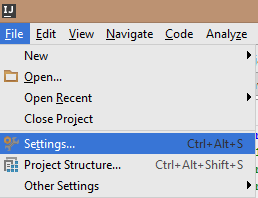

4) Search for Plugins
5) Click on **Install plugin from disk**

6) Select the plugin ZIP file and click Ok
7) Restart IntelliJ
8) Go back to the Preferences, Plugins and make sure it is listed there

This concludes the initial setup for any project that does **not** have any OSGi services with **annotations**.

#### 3.1. Maven OSGi Bundle Annotation Support

In order to support the OSGi Annotations this external plugin must be installed as well (the reason is that the
Maven OSGi Bundle plugin will create bind / unbind methods based on the annotations):

1) Open the IntelliJ Preferences again, go to Plugins 

2) Search for **Felix** and select the **Felix OSGi Annotation Processor Plugin**, then click on **Install Plugin**  

3) Accept the Download and Installation of the Plugin  

4) Accept the Restart of IntelliJ to activate the Plugin  

The **Felix OSGi Annotation Processor** hooks into the compilation process and at the end of it will handle the
**Annotation** similar to what the Maven OSGi Bundle plugin does. So when the compilation concludes the created class has
the additional methods defined like **bind...()** and **unbind...()**. This is especially important to support the
**Hot Swap** feature (runtime updated of Java code during debugging).

#### 4. Project Setup

This plugin works both with **Maven** or with a plain IntelliJ project as long as OSGi Modules **Jar** files are created correctly. **Maven** for sure it the easiest way to handle a Sling / AEM project but that is not required anymore.

**Attention**: IntelliJ has no way to generate a ZIP file based on resources so to create an Sling Package. It will deploy the content but does **not create** a package.

**Attention**: For unknown reasons the first Maven Build is failing as it cannot find its **Run** message window. Any subsequent build seems to work just fine and so the plugin will display an alert asking the user to redo a deployment.

To deploy and debug the remote AEM server the plugin needs to know which sever to connect to, user and password, etc. For that the user needs to create at least one **Server Configuration**. It is possible to have multiple server configurations and to deploy to each of them separately, but only one connection may be active at a time.

**Note**: Keep in mind that Server Configurations are **per Project** and Server Configurations must be created for each projects independently.

A Server Configuration is created by clicking on the plus (+) icon. After the creation the Server Configuration can be edited by the edit icon (3rd from the left). Configuration are only created / stored when the configuration is valid and finished by clicking on the **Ok** button. Otherwise the changes are discarded.

##### Creating a Server Configuration

1) Open the Plugin by clicking on its Icon (if not already opened)  

2) To Create: Click on the plus (+) icon

 

3) Configure the following properties in the Server Creation Dialog

###### Basic Options

 **Name**: The label for this configuration in the list of configs

 **Host**: The hostname/address of the AEM instance to connect to

 **Description**: Some descriptive text for the current connection

 **Load by Default**: Determines if/how the plugin will attempt to connect to AEM when IntelliJ is launched

  * If neither option is selected, no connection to AEM will be made automatically when IntelliJ is launched
  * If **Run Mode** is selected, the plugin will attempt to connect to AEM normally without debug support when IntelliJ
  * If **Debug Mode** is selected, the plugin will attempt to connect the debugger on the defined **Debug Port** to AEM when IntelliJ is launched

  *Note*: If the configured AEM instance is unavailable when IntelliJ starts and one of the default modes is selected, the connection will fail. It can still be manually started once the AEM instance is active.

  **Build with Maven**: Enables (default) or disables the automatic Maven Build when an OSGi Bundle is deployed. This feature ensures that the latest changes are deployed rather than the last, externally built archive.

######  Connection Options

  **Port**: The port that the AEM instance is listening for incoming connections on

  **Debug Port**: The port that the AEM instance will allow a debugger to attach to.
  *Note*: In order to use a debugger on the configured port, the AEM instance must be started in debug mode using the following property:

    -agentlib:jdwp=transport=dt_socket,server=y,suspend=n,address=30303

  **User**: The user the plugin will use to log into AEM

  **Password**: The password for that user.
  *Note*: Currently, the password field clears when the properties dialog is closed. The password is stored when the dialog is saved and does not need to be re-entered unless it changes.

  **Context Path**: If AEM is deployed as a webapp in a servlet container (e.g. Tomcat) and has a custom context path, it can be defined here

######  Timeout Options

At this time, the configurable timeouts are not supported.

######  Publishing Options

  There are currently two options for publishing behavior:
  * **Never Automatically Publish Content**: Content will not automatically be synchronized with the AEM instance
  * **Automatically Publish Resources on Change**: Content will be automatically synchronized with the AEM instance when a file change is detected.

######  Install Options

  Currently the only supported bundle installation option is **Bundle Upload**.

  The **Support OSGi Bundle** should be installed automatically, but the manual **Install** button can be used if is not.

##### Editing a Server Configuration

1) Open the Plugin by clicking on its Icon (if not already opened)

2) To Edit: Select a Configuration and click on the edit icon

3) Change the configuration properties. See the above section on "Creating a Server Configuration" for a description of the available properties.

#### Maintenance Services

##### Server Configuration Verification

In order to prevent issues, the Plugin has a Verification action that can be used to make sure the Project is compatible with the Plugin prerequisites. Press the Verification Icon and the system will go through the modules and check if they pass the requirements. If there is an issue an alert will be shown indicating the problem and the module in question is marked as **failed**.

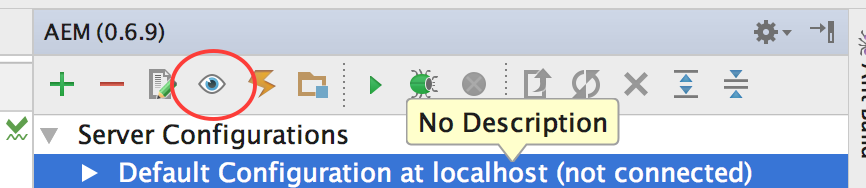

##### Purge Local Plugin Data Cache

In order to speed up deployment the plugin keeps the last modification timestamp stored locally both in memory as well as on the file system. Therefore, any file that has **not changed** since the last deployment is not deployed again.

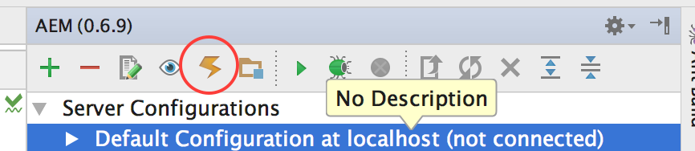

**Attention**: the plugin data cache is **per project and server**. So if a server connection changes or server changes it is necessary to purge the cache to update the server correctly. The Plugin does remember the last Server it was connected to and will purge the cache automatically if the server configuration has changed.

With **Purge Local Plugin Data Cache**, the user can wipe these cached modification timestamps and make sure that the project is deployed from scratch. This is especially important if the project is deployed onto multiple servers.
**Purge Cache** is also the first step of the **Forced Deploy** and so is the same as **Purge Cache** followed by **Deploy to Server**.

##### Edit Build Configuration

Some modules might not be part of an AEM / Sling Deployment. To avoid unnecessary build and deployment time, these modules can be excluded from the build.

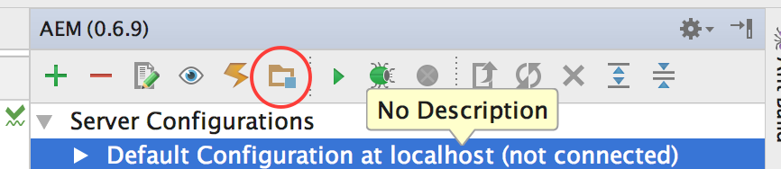

This dialog shows all included modules on the **right** and the excluded modules on the **left**. Move modules to the left to exclude them and to the right to include them back into the build:

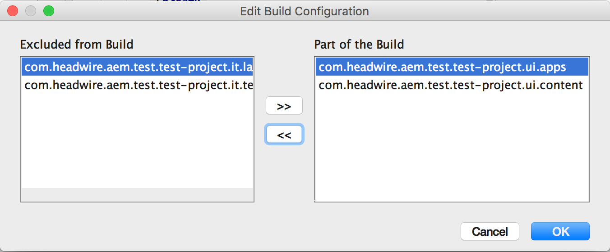

##### Global Plugin Configuration

The AEM Plugin has two properties that can be configured. Open the IntelliJ Preferences and go to the **Tools**.

You can enable / disable the **incremental builds**. This setting will enable or disable the automatic compilation while saving a Java class file (similar to Eclipse).

The **Deploy Delay** is a property that, if set to a positive number, will delay automatic deployments and queue them up. If you change a file and have a Delay of 30 seconds, then any other changed files will queue up until the 30s are over. Keep in mind that the system will queue up changes if the deployment takes some time as it is executed in the background.

#### Run against AEM / Sling Server

**Attention**: In order to prevent accidental deployment to the wrong server, you may only connect to one AEM instance at a time. To connect to another configured server, you must first **stop the connection** with the previous instance.

**Note**: Selecting a Server Configuration or a Module under that connection are the same in this context.

Running against a selected AEM Server will create or update the project module in the server configuration, check whether the Support Bundle is installed, and check if the current resources are out of date.
If a Server Connection is marked as **default**, this will happen automatically when the plugin is opened for the first time.

In order to connect to a server in run mode, select the server and click on the **play** icon:

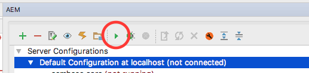

Then you will see the Configuration and its Modules together with their states:

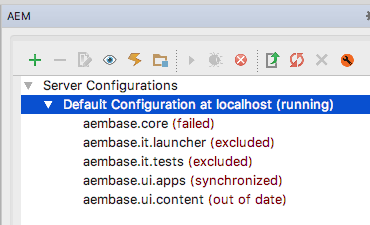

**Attention**: the Felix Maven Plugin might change the **Symbolic Name** of a bundle if the last section of the **group id** matches the beginning of the **artifact id** (it will drop the duplication). The plugin will display this warning:

If this occurs, you can fix it by creating a **Sling Facet** and overwriting the Symbolic Name there.

#### Deploy the Modules

**Attention**: OSGi Modules are deployed as a JAR file, so the Maven module must be built beforehand. Afterwards, the JAR file can be deployed as OSGi Module to the AEM OSGi container.
**Attention**: if the **Build with Maven** flag is disabled, the plugin will deploy the last built archive which might not contain the latest changes.

There are three ways to deploy the modules:  
1) Deploy the OSGi Module (will always deploy all files)
2) Deploy any **any changed** content files  
3) Force Deploy **all** content files

The deployment of the resource files can take some time depending on the number of changed files. After an initial deployment, future deployments should be much quicker as only the changed resources are deployed.

The **forced** deployment will take its time as all resource files are deployed. This option should only be used when the project is out of sync with the server, but its execution can be limited to a selected module.

This is the icon to deploy the modules:

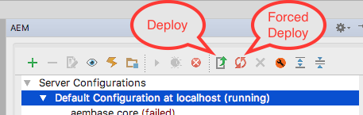

#### Deployment of a Selected Module

If a Module is selected inside the Server Configuration Tree, only **this** module will be deployed. The same thing applies to the Context Menu (see below).

#### Context Menu Options

All of the Toolbar Actions can be executed from the Context Menu inside the plugin window. The options shown depend on the current selection and its current state. The root entry (Server Configurations) will only provide **Add New Configuration**. All others will show all of the actions, but some may be disabled depending on what is selected.

**Note**: the context menu is based on the selected item in the tree and **not** on where you click to bring up the context menu.

This is the Root Entry Context Menu:

This is a Server Configuration Context Menu:

Finally, this is a Module Context Menu:

#### Debugging the Code on AEM Server

In order to use a debugger with AEM, the AEM instance must be started in debug mode using the following property:

    -agentlib:jdwp=transport=dt_socket,server=y,suspend=n,address=30303

In this example 30303 is the **Debug Port**, but it can be adjusted according to your needs as long as it does not conflict with any other TCP/IP ports used - especially the AEM Server HTTP port (normally 4052).

Keep in mind that **server=y** means the AEM Server is the target of the debug connection and must not be changed.

After the AEM Server is up and running (it is probably best to wait until the login page shows up), you can connect from the plugin.

Starting a Server Connection in Debug Mode is done here:

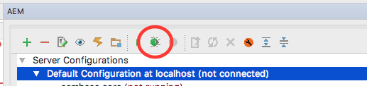

**Note**: the plugin uses the IntelliJ debug connection, and you can find its configuration it in the Run Configurations of IntelliJ under the name of the server connection. You can review the settings there, but any changes will be wiped when the Debug Connection is started again.

#### Sling Facets

In order to provide support for **non-Maven** projects, the Sling Facets were added to the plugin. These also enable a Maven project to override the **Symbolic Name** of a bundle in case the Felix Maven Plugin changes it.

In order to add a Facet, you have to open the Project Structure (normally top right), click on Facets, and then click on the plus sign (+) to add a new one. Select the **Sling Module Facet**:

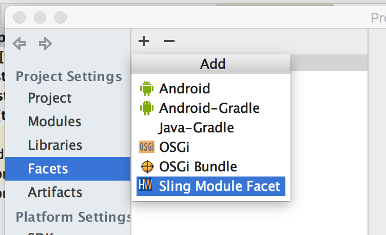

Then select the module it applies to and click **Ok**:

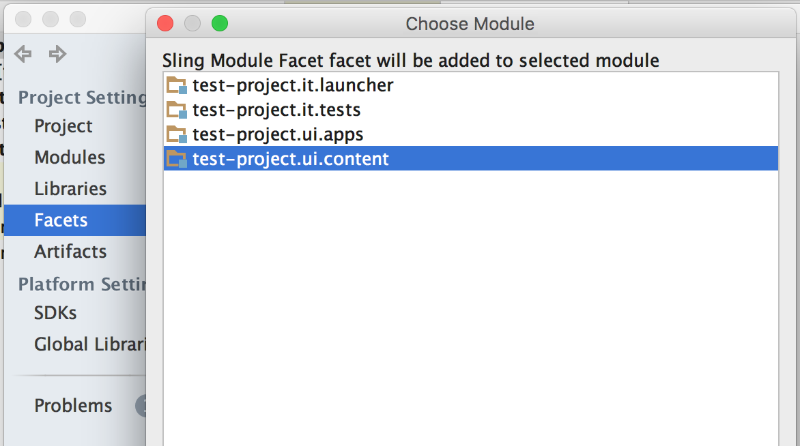

 select the appropriate module type and add its properties. This is an example configuration for a **Content Module**:
 
 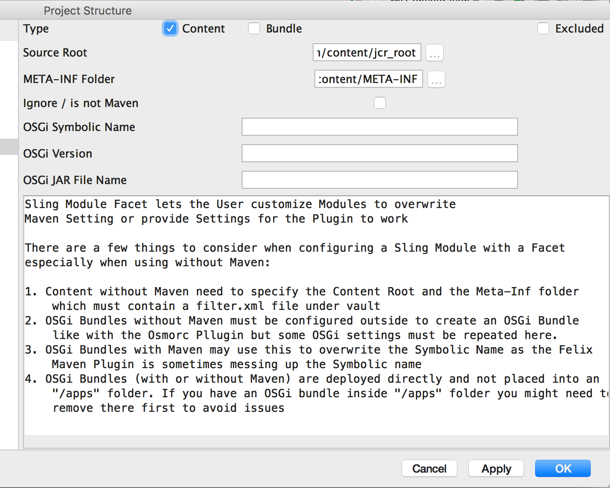
 
 A **Facet** can also be applied directly to a module. Right-click on the desired module, select **Add** and select the **Sling Module Facet**.:
 
 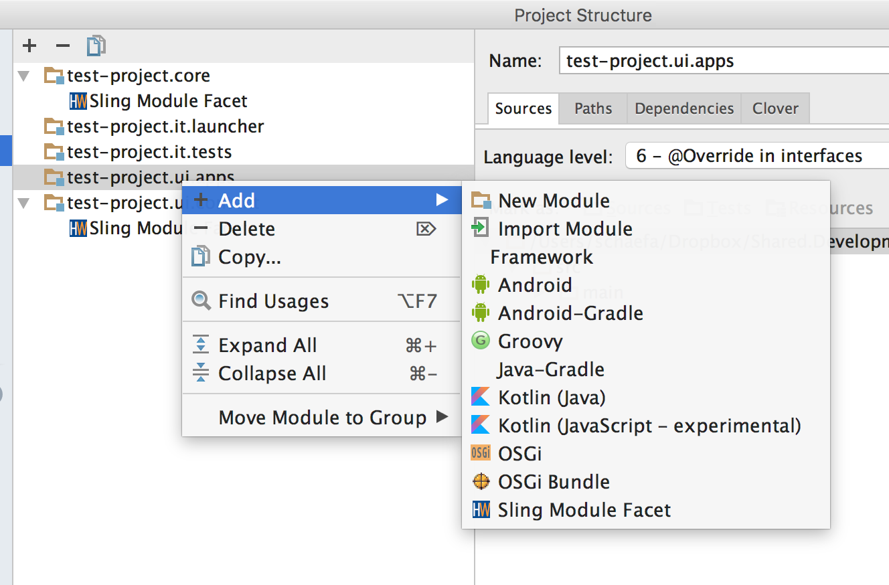
 
 This is an example configuration for an OSGi Bundle:
 
 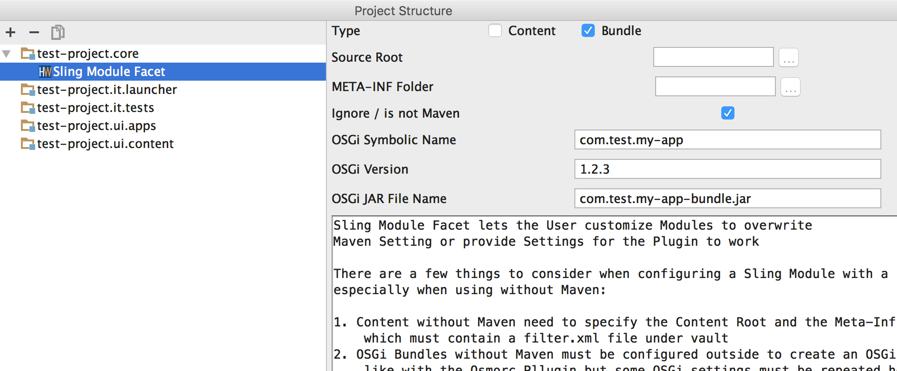
 
 If **Ignore / is not Maven** is selected, the user needs to provide the OSGi Symbolic Name, Version and Jar File Name. If not selected, then only the **OSGi Symbolic Name** is required. This overrides the symbolic name based on the Maven module.
 
 **Note**: **Excluded** removes the module from the Server Configuration, but does not remove it from the build as the build configuration does.

#### Setting up a New Maven Project Manually

**Note**: the plugin now supports the creation of a project using the Sling / AEM Archetypes from inside IntelliJ IDEA. Have a look at the **next** section.

In order to have a good starting point, it is best to create a new Maven project based on the **Adobe Maven Archetypes** which will generate a base project. That project can then be easily imported into IntelliJ IDEA by **Open** just that the root **pom.xml** file.

For more information about the Archetypes head over to its [GitHub Project Page](https://github.com/Adobe-Marketing-Cloud/aem-project-archetype) and checkout their description.

**Attention**: what the description forgets to mention is that if you don't have the Adobe repo in your Maven **settings.xml** then it will fail. If you have many projects then you might want to use a project specific settings file which would look like this:

	<?xml version="1.0" encoding="UTF-8"?>
	<settings xmlns="http://maven.apache.org/SETTINGS/1.0.0" 
	          xmlns:xsi="http://www.w3.org/2001/XMLSchema-instance" 
	          xsi:schemaLocation="http://maven.apache.org/SETTINGS/1.0.0 http://maven.apache.org/xsd/settings-1.0.0.xsd">
  
	<!-- This will not work with anyone that works outside of the Xilinx Network
	    <mirrors>
	        <mirror>
	             <id>nexus</id>
	            <name>Xilinx Nexus Server</name>
	            <url>http://wem-tools:8081/nexus/content/groups/public/</url>
	            <mirrorOf>external:*</mirrorOf>
	        </mirror>
	    </mirrors>
	-->
	    <profiles>
	      <profile>
			<id>cq</id>
			<activation>
				<activeByDefault>true</activeByDefault>
			</activation>
			<repositories>
				<repository>
					<id>adobe</id>
					<name>Adobe Repository</name>
					<url>http://repo.adobe.com/nexus/content/groups/public/</url>
					<releases>
						<enabled>true</enabled>
					</releases>
					<snapshots>
						<enabled>false</enabled>
					</snapshots>
				</repository>
			</repositories>
			<pluginRepositories>
				<pluginRepository>
					<id>adobe-plugins</id>
					<name>Adobe Plugin Repository</name>
					<url>http://repo.adobe.com/nexus/content/groups/public/</url>
					<releases>
						<enabled>true</enabled>
					</releases>
					<snapshots>
						<enabled>false</enabled>
					</snapshots>
				</pluginRepository>
			</pluginRepositories>
		</profile>
	  </profiles>
	</settings>

Then you just add
	-s ./settings.xml
to your Maven command line and you will be able to generate your project.

An example for the generation of a project would be like this:

	mvn archetype:generate \
	-DarchetypeGroupId=com.adobe.granite.archetypes \
	-DarchetypeArtifactId=aem-project-archetype \
	-DarchetypeVersion=10 \
	-DgroupId=com.test.sample \
	-DartifactId=sample-aem-project \
	-Dversion=1.0.0-SNAPSHOT \
	-Dpackage=com.test.sample \
	-DappsFolderName=aemsampleapps \
	-DartifactName='Sample AEM Project' \
	-DcomponentGroupName=aemsample \
	-DcontentFolderName=aemsamplecontent \
	-DcssId=asp \
	-DpackageGroup=aemsamplecontent \
	-DsiteName='AEM Project Sample' \
	-s ./settings.xml

The first three options set up the Maven project. The **package** is the Java package of your Java source code (OSGi Services, tests etc). The **appsFolder** is the name of the folder underneath **/apps** in the JCR tree. The **artifactName** is the description of the Maven project. **componentGroupName** is the name of the Group that the Components are placed in inside the Components Dialog. The **contentFolderName** is the name of the folder your content will be placed under the **/content** folder. The **packageGroup** is the group name of the apps / content package.

You can omit all properties that do not start with **archetype** (you will be prompted to enter them individually).

Here is a list of all supported archetypes:

#### Setting up a New Maven Project in the Plugin

From version 0.6-BETA-1 onward, the creation of a Sling / AEM project is integrated into the plugin. It is as simple as selecting the desired archetype and adding some properties to create the project and add it as a new IntelliJ IDEA project. It works similarly to the creation of a generic Maven Archetype project, but it is specific to the Sling / AEM Archetypes with support for the required properties of the AEM Archetypes.

In order to create a new project, follow these steps:

1) Select Menu -> File -> New -> Project or Menu -> File -> New Project

2) Select the **Sling** Group on the left and then select the appropriate archetype on the right

3) Enter the Maven Project Properties

4) Enter the Archetype Properties

**Attention**: The Artifact Name on the top is the same as the field in the properties window the same name below. This field is used to automatically fill in rest of the properties. In order to prevent this, you can uncheck the **Do Fill In** checkbox on the side.
After you enter the artifact name, you can still go to any property and change its value, but as long as **Do Fill In** is checked, changing the artifact name will override any other manual changes you made.
**Attention**: even though the Artifact Name is the same as the **artifactName** property below, the plugin will take the value of the property in the list below. The **Artifact Name** field is only there for **convenience**.

5) Add the Project Settings and Finish it

#### Importing Content from AEM Server

Much of the content cannot be created manually without having an existing structure to copy from. Even with such a structure, it is not necessarily easy to get it right. Complex pieces of content such as pages should be created on the server first and then imported from that server into our local IntelliJ project.

**Attention**: it is advisable to update your project with your Version Control System and deploy any changes to the server to avoid out of sync issues before making any changes to the server. In addition, changes from the imported content should be placed into the VCS fairly quickly to avoid problems for other developers.

1) **Right-click** on the node to which the content is imported. Keep in mind that content is imported from the corresponding node in the JCR tree.
2) Go to the **AEM** entry in the context menu and there select **Import from**.
3) Let the import run through

Now verify the import and add the changes to your Version Control System (VCS).

#### AEM Console

The plugin features its own notification console which will only show notifications from the plugin. It is more or less a copy of the Event Log that comes standard with IntelliJ. The one key difference is how they are configured. Instead of selecting what component to log, the AEM Console provides a list of log levels. The AEM Console can show errors, warnings, info and debug levels. Each level includes all higher levels.

**Note**: By default IntelliJ will show balloons for all of the messages, which can be overwhelming if the log level is set to info or debug. If you want to switch off the balloon messages, click the balloon icon on the AEM Console window so that the icon's background is not highlighted.

###### AEM Console Balloon Message On:

###### AEM Console Balloon Message Off:

#### AEM Developer Companion

The AEM IntelliJ tooling plugin includes a built-in version of the AEM Developer Companion, a scaffolding tool to help AEM developers quickly create many of the typical files and structures commonly found in AEM projects.

To start AEMDC within the plugin, click the wrench icon:

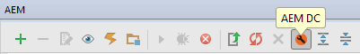

If you have not previously used AEMDC within your project, you will be prompted to configure it. If your project was built using the *AEM Lazybones Archetype*, you will see a dialog asking whether you want to automatically configure AEMDC based on your project's Lazybones configuration:
 
 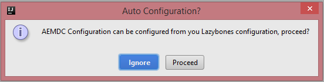
 
 Press **Ignore** to manually configure AEMDC, or **Proceed** to use the settings from Lazybones.
 
 This is the AEMDC configuration window:
 
 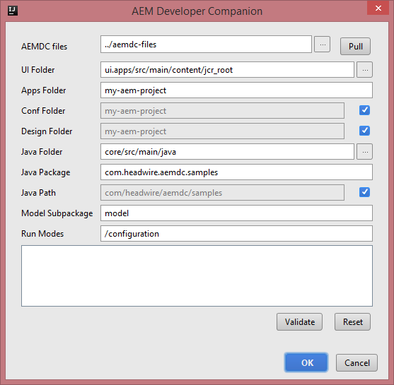
 
 If you have not already pulled AEMDC from GitHub, you can use the **Clone** button in the upper right corner to download AEMDC. Once AEMDC is cloned, that button will change to **Pull**, and can be used to get the most recent changes.
 
 For details about the configurable properties, see the **Configuration** section of the [AEMDC Wiki](https://github.com/headwirecom/aemdc/wiki#configuration) on GitHub.
 
 Once you've configured AEMDC, you can click **Validate** to ensure that your settings are valid. Then press **OK** to save the settings. This will launch the AEMDC tool itself:
 
 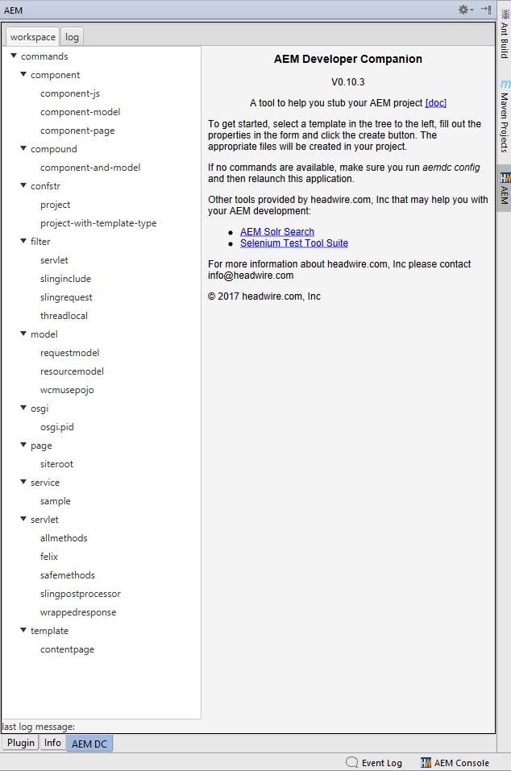
 
 AEMDC will appear as a new tab within the AEM IntelliJ plugin. To switch back to the main plugin, click the **Plugin** tab.
 
 For information on how to use AEMDC, visit its [GitHub Wiki Page](https://github.com/headwirecom/aemdc/wiki).

#### Troubleshooting

##### Installation

If the installation or startup of the plugin fails, please have a look at the idea.log and report any errors / exceptions through the plugin's GitHub issue tracker page. The plugin is designed for IntelliJ **16 and up** and your mileage may vary with older versions.

##### Configuration

If you can connect to your AEM Server through a web browser, you should be able to connect to it through the plugin in run mode. For debug mode, the debug port used must be passed as an argument when starting the AEM instance (please see the section "**Debugging the Code on AEM Server**" earlier in this document). It is also preferable to use a local server for development to reduce the lag and latency.
If the Debug Connection is failing for unknown reasons, then a TCP Proxy can be used to watch the conversation between the IDEA and AEM. A good tool for that is [The Grinder](http://grinder.sourceforge.net/g3/tcpproxy.html), which can be installed quickly and will report any traffic between IDEA and AEM. In order to make this work, you must set the debug port in the AEM plugin options to be **different** from the debug port defined in the AEM start parameters. Set the outgoing connection port to the debug port of the AEM server and the incoming connection port to the port configured in the plugin. Then you can connect to the AEM Server through the proxy, and you might be able to see why the connection fails.

###### Password

The password in the Server Configuration is left empty and will only show dots for input when a new password is entered. An empty field indicates that the password hasn't changed and **does not** have to be reentered.

##### Connection

If the plugin connects to the server in run mode (to see if the modules / resources are up to date), the physical connection will close when it is finished. That said, in order to prevent accidental switches between servers, the connection must be stopped even if it is not used anymore. After the connection is stopped the user can check, connect or deploy to another server by starting that connection in **run mode**.

##### Deployment

The plugin will not check OSGi dependencies and successful activation of modules. OSGi can deploy a module successfully but fail to activate or even to enable a component. 

It is **recommended** to make a full deployment of the project at the beginning of major changes, including pulling changes from GIT to ensure that everything is properly deployed. Afterwards, Resources, OSGi Modules and classes can be deployed incrementally.

For the Content, there is a problem where the Jackrabbit client code cannot handle parent folders of filtered files which are outside the filter and do not contain a content configuration file (.content.xml) or do not exist on the server. For example, the filter has an entry **/apps/test/components** and there is a parent folder called **/apps/test** and it neither contains a .content.xml file nor does it exist on the server.

There are two ways to fix this. Either create a .content.xml file, or deploy the content to the server manually **outside of the plugin first** so that the folder already exists when the content is deployed.

Keep in mind that the Plugin keeps a local cache of the last deployed time of Content files and will only redeploy them when changes are made. If there are any changes made to the project that are not reflected in a changed last modification timestamp of a file, then it is advisable to either **Reset the Configuration** or do a **Forced Deployment**. Both options do more or less the same thing, but a reset it permanently resets the cache whereas the Force Deployment temporarily ignores it. The forced deployment can be limited to a module and in does not change the cached timestamps.

###### Fixing Deployment Issues

These are steps to troubleshoot deployments:

1. Verify the Project
2. Fetch any changes from VCS
3. Purge Plugin Cache Data and Deploy or Force Deploy
4. Build and Deploy the Project either manually or via Maven (with Profiles) outside the Plugin

###### Hot Swap

When the plugin is connected in **Debug Mode** to the remote AEM Server, a class can be hot swapped if there were only changes made to **method bodies**. Hot Swap will fail if there are any changes made to the class (adding methods, adding members, changing method signatures, etc). If the incremental build is enabled, the HotSwapping is done whenever a Java file is saved.

Because the Hot Swap is done automatically, class changes will cause an error during development if the Connection is started in Debug Mode. Therefore, regular development should be done with the Debug Connection stopped.

**Attention**: HotSwap will replace class code **in memory only**, meaning that a restart of the AEM Server will wipe any changes. It is necessary to deploy OSGi modules as soon as possible to avoid erratic behavior.
